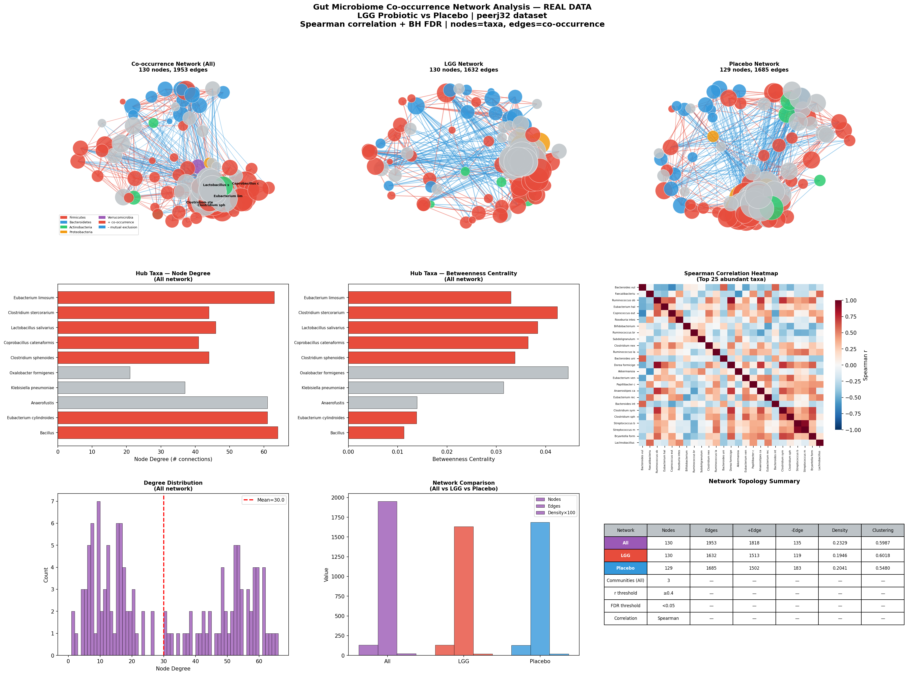

# Day 07 — Gut Microbiome Co-occurrence Network Analysis
### 🧬 30 Days of Bioinformatics | Subhadip Jana


> Building and comparing gut microbiome co-occurrence networks for LGG probiotic vs Placebo using Spearman correlation + BH FDR filtering + NetworkX graph analysis.

---

## 📊 Dashboard


---

## 🔬 What is a Co-occurrence Network?
- **Nodes** = bacterial taxa
- **Edges** = significant co-occurrence (positive) or mutual exclusion (negative)
- **Edge weight** = Spearman correlation strength
- **Hub taxa** = highly connected nodes that influence the whole community

---

## 📈 Network Topology Results

| Metric | All samples | LGG | Placebo |
|--------|-------------|-----|---------|
| Nodes | 130 | 130 | 129 |
| Edges | 1953 | 1632 | 1685 |
| Density | 0.233 | 0.195 | 0.204 |
| Avg Clustering | 0.599 | 0.602 | 0.548 |
| + edges | 1818 | 1513 | 1502 |
| **− edges** | **135** | **119** | **183** |
| Communities | 3 | — | — |

**Key findings:**
- Placebo network has **35% more negative edges** (183 vs 135) — more competitive/exclusionary microbial interactions
- LGG network has higher clustering coefficient (0.602) — tighter microbial communities
- 3 distinct microbial communities detected by modularity analysis

---

## 🏆 Top Hub Taxa (All network)

| Taxon | Degree | Betweenness |
|-------|--------|-------------|
| *Eubacterium limosum* | 63 | 0.033 |
| *Clostridium stercorarium* | 44 | 0.042 |
| *Lactobacillus salivarius* | 46 | 0.038 |
| *Coprobacillus catenaformis* | 41 | 0.036 |
| *Clostridium sphenoides* | 44 | 0.034 |

---

## 🚀 How to Run
```bash
pip install pandas numpy matplotlib seaborn scipy networkx scikit-learn
python network_analysis.py
```

---

## 📁 Structure
```
day07-network-analysis/
├── network_analysis.py
├── data/
│   ├── otu_table.csv
│   └── metadata.csv
├── outputs/
│   ├── correlation_matrix.csv
│   ├── hub_taxa.csv
│   └── network_dashboard.png
└── README.md
```

---

## 🔗 Part of #30DaysOfBioinformatics
**Author:** Subhadip Jana | [GitHub](https://github.com/SubhadipJana1409) | [LinkedIn](https://linkedin.com/in/subhadip-jana1409)
